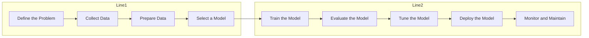

<!--
 Copyright (c) 2024 David Such
 
 This software is released under the MIT License.
 https://opensource.org/licenses/MIT
-->

```mermaid
graph LR
    subgraph Line1
        A[Define the Problem] --> B[Collect Data]
        B --> C[Prepare Data]
        C --> D[Select a Model]
    end
    subgraph Line2
        D --> E[Train the Model]
        E --> F[Evaluate the Model]
        F --> G[Tune the Model]
        G --> H[Deploy the Model]
        H --> I[Monitor and Maintain]
    end
```